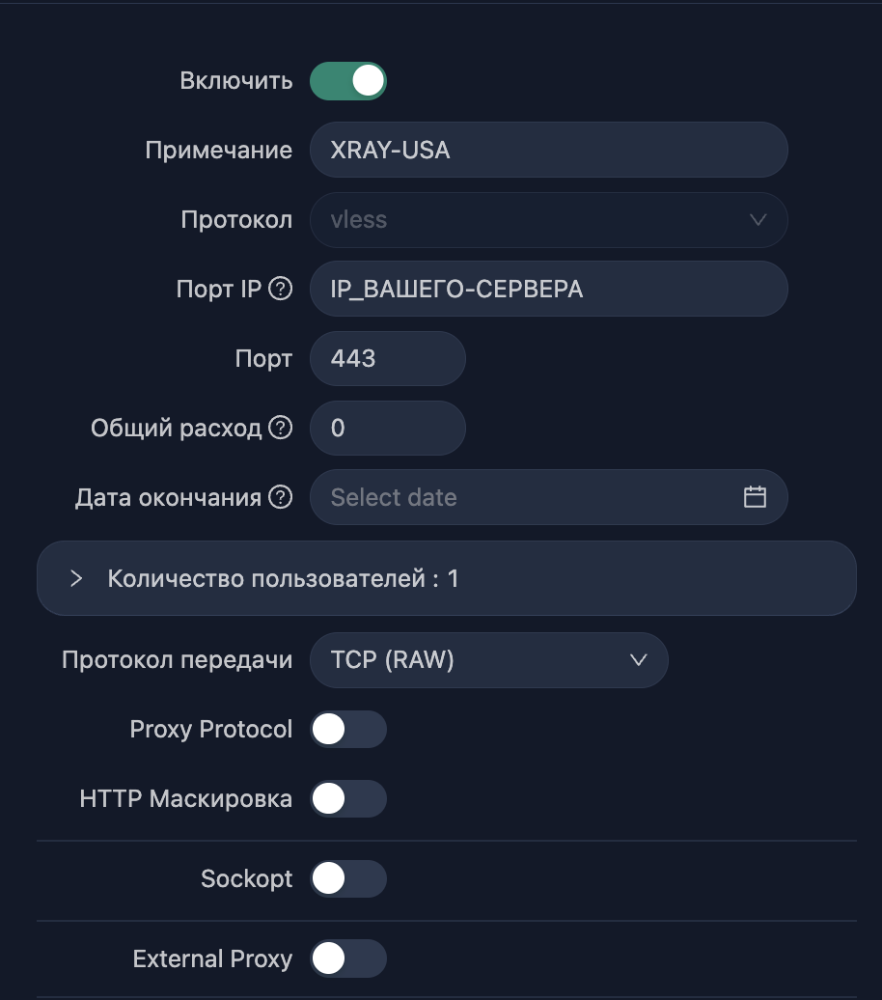
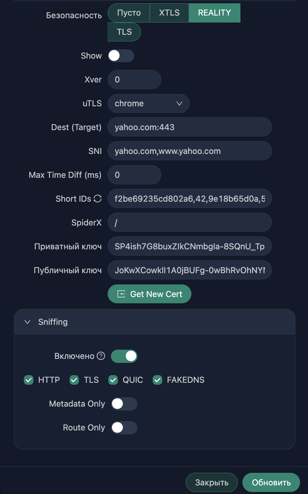
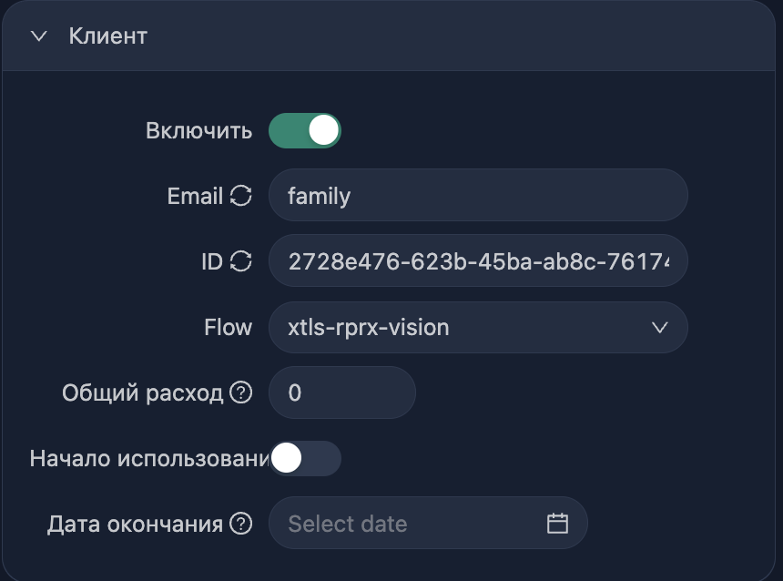

# VLESS Proxy Server Auto Setup

Автоматизированная установка и настройка VLESS прокси-сервера с панелью управления 3X-UI.

## 📋 Описание

Этот набор скриптов автоматизирует процесс установки и настройки VLESS прокси-сервера на базе Ubuntu/Debian. 
Скрипты выполняют все необходимые шаги безопасности и настройки.

## 🚀 Быстрый старт

### 1. Подготовка сервера

Скопируйте основной скрипт на ваш VPS сервер:

```bash
# Подключитесь к серверу
ssh root@ваш_IP_адрес

# Скачайте скрипт
wget https://raw.githubusercontent.com/kirillparfenov/xray_vless/main/vless-proxy-setup.sh

# Сделайте скрипт исполняемым
chmod +x vless-proxy-setup.sh

# Запустите установку
./vless-proxy-setup.sh
```

### 2. Настройка SSH-ключей (с локального компьютера)

После перезагрузки сервера, на вашем локальном компьютере:

```bash
# Скачайте скрипт настройки SSH-ключей
wget https://raw.githubusercontent.com/kirillparfenov/xray_vless/main/setup-ssh-keys.sh

# Сделайте скрипт исполняемым
chmod +x setup-ssh-keys.sh

# Запустите настройку SSH-ключей
./setup-ssh-keys.sh
```
### 3. Проверка статуса сервера

После настройки SSH-ключей и входа на ваше сервер

```bash
# Скачайте скрипт
wget https://raw.githubusercontent.com/kirillparfenov/xray_vless/main/check-server-status.sh

# Сделайте скрипт исполняемым
chmod +x check-server-status.sh

# Запустите проверку сервера
sudo ./check-server-status.sh
```
### 4. Создайте клиентов через графическую панель 3X-UI

[🎯 Ручная настройка Xray через панель (перейти)](#-Ручная-настройка-Xray-через-панель)

## 📁 Файлы проекта

- **`vless-proxy-setup.sh`** - Основной скрипт установки сервера
- **`setup-ssh-keys.sh`** - Скрипт настройки SSH-ключей (запускается с локального компьютера)
- **`check-server-status.sh`** - Скрипт проверки статуса сервера
- **`README.md`** - Данная инструкция

## 🔧 Что делает основной скрипт

### Безопасность системы:
- ✅ Обновление системы
- ✅ Смена пароля root
- ✅ Изменение SSH порта на нестандартный
- ✅ Настройка firewall (UFW)
- ✅ Создание нового пользователя с sudo правами
- ✅ Отключение входа root через SSH
- ✅ Подготовка для настройки SSH-ключей (аутентификация по паролю временно включена)

### Установка компонентов:
- ✅ Установка необходимых пакетов (git, docker, curl, etc.)
- ✅ Скачивание RealiTLScanner для поиска маскировочных сайтов
- ✅ Установка и запуск панели 3X-UI
- ✅ Настройка Docker контейнеров

### Автоматизация:
- ✅ Создание скриптов для сканирования Reality сайтов
- ✅ Настройка портов и firewall правил
- ✅ Создание информационного файла с настройками

## 🔑 Настройка SSH-ключей

Скрипт `setup-ssh-keys.sh` автоматизирует:

- 🔐 Генерацию SSH-ключей (если отсутствуют)
- 📤 Копирование публичного ключа на сервер
- ✅ Тестирование подключения по ключам
- 🔒 **Отключение аутентификации по паролю** (переход на работу только с ключами)
- ⚙️ Создание **уникальной** SSH конфигурации для каждого сервера
- 🌐 Создание отдельного скрипта SSH туннеля для каждого сервера
- 🛡️ Защита от перезатирания конфигураций при работе с несколькими серверами

### 🔄 Поддержка нескольких серверов

Скрипт поддерживает настройку **множественных VLESS серверов** без конфликтов:

- **Уникальные имена:** Каждый сервер получает уникальное имя в SSH config
- **По умолчанию:** `vless-proxy-XXX` (где XXX - последний октет IP адреса)
- **Кастомные имена:** Можно задать собственное имя для каждого сервера
- **Отдельные туннели:** Каждый сервер получает свой скрипт туннеля

**Пример для нескольких серверов:**
```bash
# Сервер 1 (192.168.1.100)
ssh vless-proxy-100
~/vless-tunnel-vless-proxy-100.sh

# Сервер 2 (192.168.1.200)
ssh vless-proxy-200
~/vless-tunnel-vless-proxy-200.sh

# Сервер 3 (с кастомным именем)
ssh my-vless-server
~/vless-tunnel-my-vless-server.sh
```

## 📊 Панель управления 3X-UI

После установки панель доступна через SSH туннель:

### Подключение к панели:
```bash
# Создание SSH туннеля (автоматически создается скрипт)
~/vless-tunnel-vless-proxy-XXX.sh

# Или вручную:
ssh -L 23456:127.0.0.1:2053 username@server_ip -p ssh_port
# 23456 - свободный порт на вашем локальном компьютере
# 2053 - порт панели по-умолчанию
```

### Доступ к панели:
- **URL:** http://127.0.0.1:23456/
- **Логин:** admin
- **Пароль:** admin

⚠️ **Важно:** Сразу после первого входа смените логин и пароль!

## 🔍 Поиск маскировочных сайтов

После установки используйте RealiTLScanner для поиска подходящих сайтов:

```bash
# Подключитесь к серверу
ssh vless-proxy

# Запустите сканирование
sudo /opt/scan_reality.sh
```

Выберите подходящий сайт из результатов для настройки Reality маскировки.

## 📋 Полезные команды

### Управление сервером:
```bash
# Подключение к серверу (после настройки SSH-ключей)
ssh vless-proxy-XXX  # где XXX - ваше имя сервера

# Проверка статуса Docker контейнеров
docker ps

# Просмотр логов 3X-UI
cd /opt/3x-ui && docker-compose logs

# Проверка открытых портов
ss -lntup

# Статус firewall
sudo ufw status
```

### Управление несколькими серверами:
```bash
# Подключение к разным серверам
ssh vless-proxy-100    # Первый сервер
ssh vless-proxy-200    # Второй сервер
ssh my-custom-server   # Сервер с кастомным именем

# SSH туннели к разным панелям
~/vless-tunnel-vless-proxy-100.sh    # Панель первого сервера
~/vless-tunnel-vless-proxy-200.sh    # Панель второго сервера
~/vless-tunnel-my-custom-server.sh   # Панель кастомного сервера

# Просмотр всех настроенных серверов
grep "Host vless-" ~/.ssh/config
```

### Управление 3X-UI:
```bash
# Перезапуск панели
cd /opt/3x-ui && docker-compose restart

# Остановка панели
cd /opt/3x-ui && docker-compose down

# Запуск панели
cd /opt/3x-ui && docker-compose up -d
```

## 🛡️ Безопасность

Скрипты автоматически настраивают:

- 🔒 Отключение входа root через SSH
- 🔑 Аутентификация только по SSH-ключам (настраивается в `setup-ssh-keys.sh`)
- 🚪 Нестандартный SSH порт
- 🛡️ Настройка firewall с минимальными правами
- 👤 Создание отдельного пользователя для работы

**Важно:** Основной скрипт `vless-proxy-setup.sh` оставляет возможность входа по паролю для нового пользователя. Отключение аутентификации по паролю происходит в скрипте `setup-ssh-keys.sh` после успешной настройки SSH-ключей.

## 🎯 Ручная настройка Xray через панель

> **Примечание:** После каждого изменения обязательно нажимайте "Сохранить" или "Сохранить настройки"

### 📋 Настройки панели управления

**Путь:** Настройка панели → Настройка панели

```
IP-адрес панели: 127.0.0.1
Домен прослушивания панели: 127.0.0.1
```

### 🔒 Дополнительные блокировки

**Путь:** Настройки XRAY → Правила маршрутизации → Добавить правило

```
[
   Domain: geosite:category-ru,regexp:.*\.ru$,regexp:.*\.su$
   Outbound Tag: blocked
]
```

### 🌐 Настройка клиентов Reality

**Путь:** Подключения → Добавить подключение


```
[
   - Порт IP: ip адрес вашего сервера
   - Безопасность: REALITY
   - Dest (Target): Если вы сканировали адреса 
      с помощью команды sudo /opt/scan_reality.sh, 
      то в Dest и SNI вставляете домен 
      найденного сайта по аналогии. 
      Если не сканировали - в Dest и SNI оставляете yahoo.
   - Жмете Get New Cert
]
```

```
[
   Добавляете пользователя
]
```

## 📱 Клиентские приложения для подключения

После настройки VLESS сервера используйте следующие приложения для подключения:

### 🍎 macOS
- **[Karing](https://github.com/KaringX/karing/releases)** - Современный клиент с поддержкой VLESS и Reality
- **[ClashX Pro](https://install.appcenter.ms/users/clashx/apps/clashx-pro/distribution_groups/public)** - Популярный клиент с графическим интерфейсом
- **[V2rayU](https://github.com/yanue/V2rayU/releases)** - Простой в использовании клиент

### 📱 iOS
- **Streisand** - Рекомендуемый клиент для iOS
- **[Shadowrocket](https://apps.apple.com/app/shadowrocket/id932747118)** - Платный, но функциональный клиент
- **[OneClick](https://apps.apple.com/app/oneclick-safe-easy-fast/id1545555197)** - Бесплатная альтернатива

### 🤖 Android
- **[v2rayNG](https://github.com/2dust/v2rayNG/releases)** - Популярный бесплатный клиент
- **[Clash for Android](https://github.com/Kr328/ClashForAndroid/releases)** - Мощный клиент с правилами
- **[SagerNet](https://github.com/SagerNet/SagerNet/releases)** - Продвинутый клиент с множеством протоколов

### 🖥️ Windows
- **[v2rayN](https://github.com/2dust/v2rayN/releases)** - Самый популярный клиент для Windows
- **[Clash for Windows](https://github.com/Fndroid/clash_for_windows_pkg/releases)** - Клиент с графическим интерфейсом
- **[Qv2ray](https://github.com/Qv2ray/Qv2ray/releases)** - Кроссплатформенный клиент

### 🐧 Linux
- **[v2ray-core](https://github.com/v2fly/v2ray-core/releases)** - Официальный клиент командной строки
- **[Qv2ray](https://github.com/Qv2ray/Qv2ray/releases)** - GUI клиент для Linux
- **[Clash](https://github.com/Dreamacro/clash/releases)** - Клиент командной строки

### 📋 Инструкции по подключению:

1. **Скачайте и установите** подходящее приложение для вашей ОС
2. **Получите конфигурацию** из панели 3X-UI (QR-код или ссылка)
3. **Импортируйте конфигурацию** в приложение
4. **Активируйте подключение** и проверьте работоспособность

### 💡 Рекомендации:

- **Для новичков:** v2rayNG (Android), v2rayN (Windows), Karing (macOS)
- **Для продвинутых:** Clash-клиенты с возможностью настройки правил
- **Для мобильных:** Приложения с поддержкой автоматического переключения

---

## 🔧 Устранение неполадок

### Проблемы с подключением:
```bash
# Проверка статуса SSH
sudo systemctl status sshd

# Проверка firewall
sudo ufw status verbose

# Проверка портов
ss -lntup | grep LISTEN
```

### Проблемы с Docker:
```bash
# Статус Docker
sudo systemctl status docker

# Перезапуск Docker
sudo systemctl restart docker

# Логи контейнеров
docker logs container_name
```

## 📞 Поддержка

Если возникли проблемы:

1. Проверьте логи установки в `/root/vless_setup_info.txt`
2. Убедитесь, что все порты открыты в firewall
3. Проверьте статус всех сервисов
4. При необходимости повторите установку на чистом сервере

## ⚠️ Важные замечания

- 🔄 **Перезагрузка:** Сервер автоматически перезагружается после установки
- 🔑 **SSH-ключи:** Обязательно настройте SSH-ключи с помощью `setup-ssh-keys.sh`
- 🔒 **Безопасность SSH:** Аутентификация по паролю отключается только после настройки SSH-ключей
- 🔒 **Пароли панели:** Смените стандартные пароли панели управления (admin/admin)
- 💾 **Бэкап:** Сохраните файл с настройками в безопасном месте
- 🌐 **Домен:** Для продакшена рекомендуется использовать собственный домен

## 📋 Последовательность действий

### Для одного сервера:
1. **На сервере:** Запустите `vless-proxy-setup.sh` от root
2. **После перезагрузки:** Запустите `setup-ssh-keys.sh` с локального компьютера
3. **Подключение:** Используйте SSH-ключи для безопасного доступа
4. **Настройка:** Настройте VLESS через веб-панель

### Для нескольких серверов:
1. **Повторите шаги 1-2** для каждого сервера
2. **При настройке SSH-ключей** задавайте уникальные имена:
   - `vless-proxy-1`, `vless-proxy-2` и т.д.
   - Или собственные имена: `server-usa`, `server-eu`, `server-asia`
3. **Подключение к нужному серверу:** `ssh имя-сервера`
4. **Доступ к панели:** `~/vless-tunnel-имя-сервера.sh`

### 💡 Советы для множественных серверов:
- Используйте понятные имена серверов (например, по географии или назначению)
- Ведите список серверов в отдельном файле
- Регулярно проверяйте статус всех серверов
- Делайте резервные копии SSH конфигураций

## 📄 Лицензия

Скрипты предоставляются "как есть" для образовательных целей. Используйте на свой страх и риск.

---

**Версия:** 1.0  
**Совместимость:** Ubuntu 20.04+, Debian 10+  
**Требования:** Root доступ к серверу